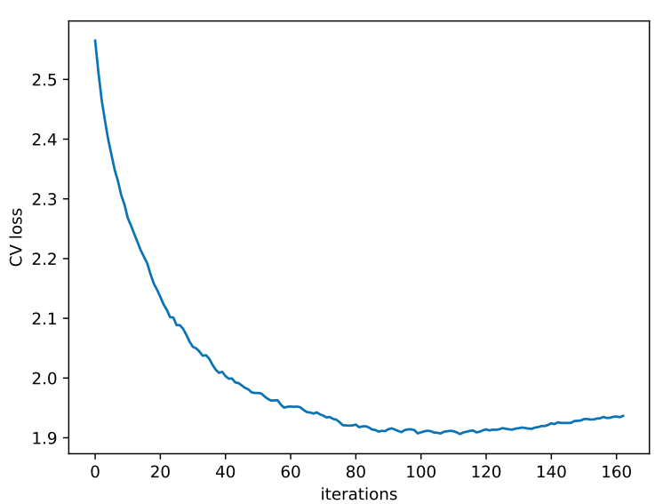
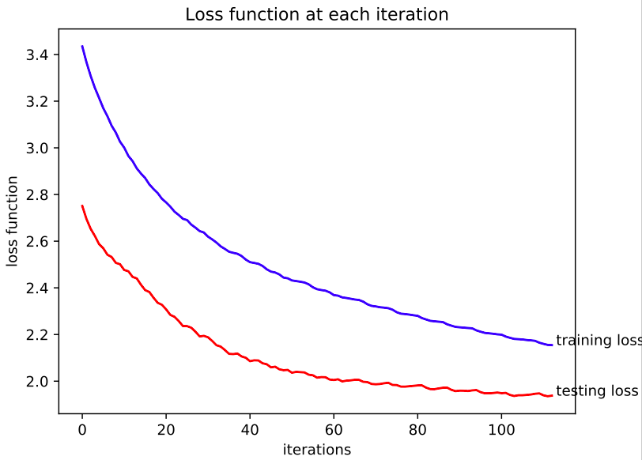
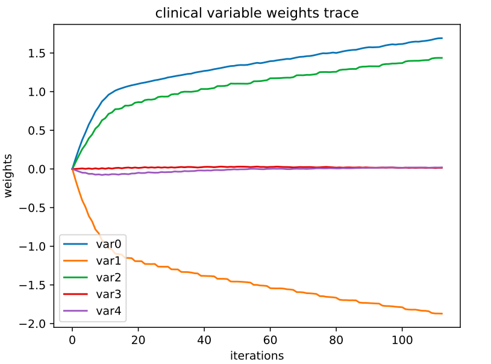
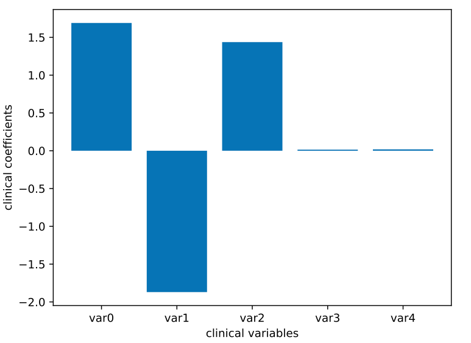
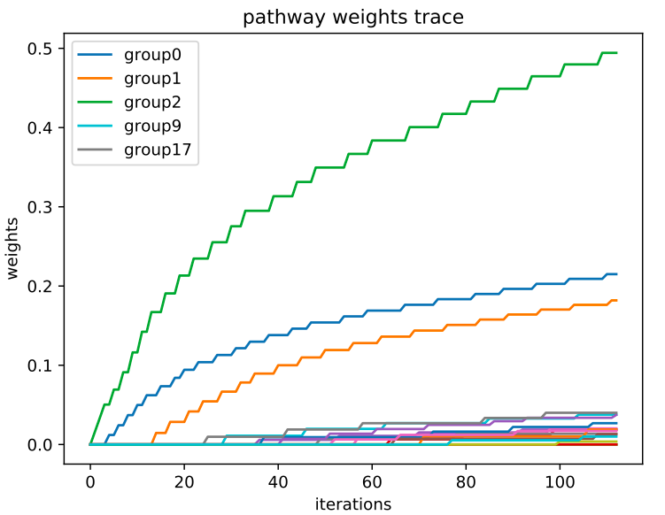
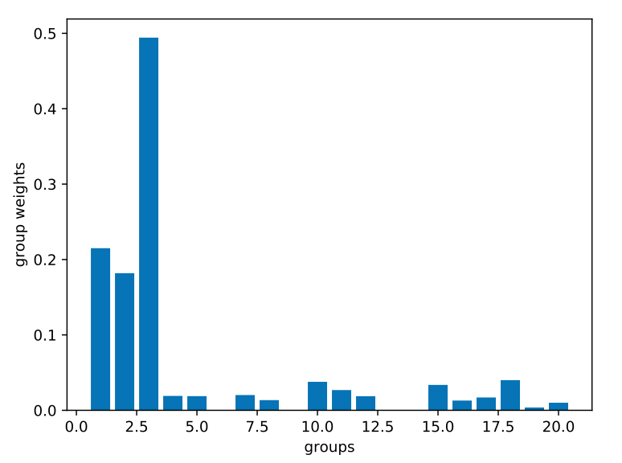

# PKB instructions

This article provides an instruction for using the **PKB** (Pathway-based Kernel Boosting) model to analyze cancer genomic datasets. PKB is designed to perform classification, regression, or survival analysis on datasets from typical cancer genomic studies. It utilizes cancer patients' **clinical features** (e.g. age, gender, tumor stage, etc), and **gene expression** profile, to predict the outcome variable, which can be **categorical** (e.g. metastasis status), **continuous** (e.g. drug response, tumor size), or **survival** (e.g. overall survival, disease free survival). It also incorporates gene pathway information to improve prediction accuracy, and provides more interpretable results.

This repository is a generalized version of [PKB](https://github.com/zengliX/PKB). The earlier version can only perform classification analysis and cannot use clinical features as predictors. 

### Reference
Zeng, L., Yu, Z., Zhang, Y. and Zhao, H. (2018) A general kernel boosting framework to integrate pathways for cancer genomic data analysis – _Working paper_


### Page Contents

- [About PKB](#pkb)
- [Software requirement](#software)
- [Input Data Preparation](#data)
- [Using PKB](#run)
- [Results Interpretation](#results)

## <a name=pkb></a> About PKB
PKB is a boosting-based method for utilizing pathway information to better predict clinical outcomes. It constructs base learners from each pathway using kernel functions. In each boosting iteration, it identifies the optimal base learner and adds it to the prediction function.

The algorithm has two parts. The first part involves determining an optimal number of iterations using cross validation (CV). In this part, we split the training data into 3-folds, fit the boosting model, and monitor the loss values (averaged over the 3 test data) at each iteration. The iteration (T) with minimum CV loss is used as iteration numbers.

In part two, we use the whole training data to fit the boosting model to T iterations. Figures and tables will be generated to present relevant clinical predictors/pathways, and the boosting procedure.

Please refer to the original paper for more technical details.

## <a name=software></a> Software requirement   
The program is written in **Python3**. Please make sre the following packages are properly installed before running the program: 

- pandas
- numpy
- scipy
- matplotlib
- pickle
- argparse
- sklearn


## <a name=data></a> Input data preparation
PKB requires the input datasets to be formatted in certain ways. 

### Outcome variable file
Please refer to `example/*/response.txt` for examples of response file for different problems. It needs to be a comma-separated file with two columns (for regression and classification) or three columns (for survival). 

- Example for classification:

  sample | response 
  ------- | --------- 
  sample1 | 1 
  sample2 | -1
  sample3 | -1   
  ...     | ... 

- Example for regression:

  sample | response 
  ------- | --------- 
  sample1 | 2.33
  sample2 | 1.85
  sample3 | 0.51 
  ...     | ... 
  
- Example for survival analysis:

  sample | survival | censor
  ------- | ------- | ----------- 
  sample1 | 25.5  | 1
  sample2 | 50.3  | 0
  sample3 | 3.8   | 0
  ...     | ...   | ...

In the survival file, the `survival` column represent survival times of the patients (using months as unit recommended). The `cencor` column equals to `0` is an endpoint event is observe, otherwise `1`. 

### Gene expression input
Please refer to `example/*/expression.txt` for an example. It is also a comma-separated file. The first column is sample ID, and the other columns are genes. The first row will be used as header, and each other row represents one sample.

Example:

| sample  | gene1 | gene2 | gene3 | gene4 | ... |
|---------|-------|-------|-------|-------|-----|
| sample1 | 1.2   | 3.3   | 4.5   | 0.1   | ... |
| sample2 | 0.5   | 2.6   | 2.3   | 1.2   | ... |
| sample3 | 0.1   | 1.4   | 0.1   | 2.2   | ... |
| sample4 | 0.8   | 0.2   | 8.6   | 1.8   | ... |
| ...     | ...   | ...   | ...   | ...   | ... |

### Clinical predictor input
The format for clinical predictors is the same as in gene expression input. Please check out `example/*/clinical.txt` for examples.

Example:

| sample  | var0 | var1 | var2 | var3 | ... |
|---------|-------|-------|-------|-------|-----|
| sample1 | 1   | 0   | 35   | 168   | ... |
| sample2 | 0   | 0   | 58   | 190   | ... |
| sample3 | 1   | 0   | 77   | 177   | ... |
| sample4 | 1   | 1   | 63   | 175   | ... |
| ...     | ...   | ...   | ...   | ...   | ... |

### Pathway input
You can either provide your own pathway file, or use the built-in files, including  **KEGG, Biocarta**, and **GO Biological Process pathways**. 

To use the built-in pathways, just use the corresponding files in `./pathways` folder when running PKB.

If you would like to use customized pathway file, please refer to `example/*/pathways.txt` for an example. It should be a comma-separated file with no header. The first column are the names of pathways, and the second column are the lists of individual pathway members. Each list is a string of genes separated by spaces.

Example:

  pathway| genes (do not include this row in your file)
  ------- | --------- 
  pathway1 | gene11 gene12 gene13 gene14 
  pathway2 | gene21 gene22
  pathway3 | gene31 gene32 gene33
  pathway4 | gene41 gene42
  ...     | ... 

## <a name=run></a> Running PKB
Follow the steps below in order to run PKB on your own computer (we use our toy dataset as example):

1. clone this git repository :

	```bash
	git clone https://github.com/zengliX/PKB2 PKB2
	cd PKB2
	```
2. prepare datasets following the format given in the previous section

3. run PKB  

	```python
	# regression example
	python PKB2.py regression example/regression_example regression_results \
	expression.txt pathways.txt response.txt poly3 L2 -clinical clinical.txt \
	-rate 0.1 -maxiter 500 -test test_label.txt -pen 0.1
	
	# survival example
	python PKB2.py survival example/survival_example survival_results \
	expression.txt pathways.txt response.txt poly3 L2 -clinical clinical.txt \
	-rate 0.1 -maxiter 500 -test test_label.txt -pen 0.1
	```

There a quite a few parameter you need to specify. You can access the help message by command `python PKB2.py -h`. The following message will be displayed:

```
usage: PKB2.py [-h] [-clinical CLINICAL] [-maxiter MAXITER] [-rate RATE]
               [-Lambda LAMBDA] [-test TEST] [-pen PEN] [-weights WEIGHTS]
               problem input output predictor predictor_set response kernel
               method

positional arguments:
  problem             type of analysis (classification/regression/survival)
  input               Input folder
  output              Output folder
  predictor           predictor file
  predictor_set       file that specifies predictor group structure
  response            outcome data file
  kernel              kernel function (rbf/poly3)
  method              regularization (L1/L2)

optional arguments:
  -h, --help          show this help message and exit
  -clinical CLINICAL  file of clinical predictors
  -maxiter MAXITER    maximum number of iteration (default 800)
  -rate RATE          learning rate parameter (default 0.05)
  -Lambda LAMBDA      penalty parameter
  -test TEST          file containing test data index
  -pen PEN            penalty multiplier
  -weights WEIGHTS    file with gene weights
```

The outputs will be saved in the `output`-folder.	
Below we provide more detailed explanations to selected parameters:

- `predictor, predictor_set, response, -clinical`	 
   represent paths to the files for gene expression, pathways, outcome variable, and clinical predictors, respectively. The paths are **relative paths to the `input` folder**. So if the files are in the `input` folder, you can just use their names.
- `kernel`	
	Currently, we only support radial basis function (rbf) and polynomial kernels (`polyd` for polynomial kernel with degree `d`) 
- `Lambda`	
	Penalty parameter used in the regularized loss function, to control complexity of selected base learners. If left bland, we will use an automatic procedure to calculate a feasible `Lambda`
- `pen`		
	**Penalty multiplier**. The auto-calculated Lambda usually put too strong penalty. You can use the penalty multiplier `pen` to reduce it `Lambda*pen`
- `test`		
	Test label file, which contains the sample IDs to be used as testing data. Refer to `example/*/test_label.txt` for example. The samples included in the file will be used as testing data, and will not be used to train the model.

## <a name=results></a> Results interpretation
We use the resulting figures and tables from the previous survival analysis as an example.

### Figures
1. `CV_loss.pdf` (left) and  `loss.pdf` (right)   

	- The CV loss figure presents the curve loss when performing 3-folder CV on training data. The iteration reaching bottom of the curve is used to train the whole training dataset.
	- The loss figure present both training and testing loss curves when fitting the whole training dataset.

	<table> 
	<tr><td></td> 
   	  <td></td> 
	</tr> 
	</table> 

2. `clinical_weights_path.pdf`, clinical feature coefficients at each iteration (left)   
  `clinical_weights.pdf`, clinical feature coefficients in the final model (right)    
  
	<table> 
	<tr><td></td> 
   	  <td></td> 
	</tr> 
	</table> 


3. `group_weights_path.pdf`, pathway weights in each iteration (left)   
	`group_weights_path.pdf`, pathway weights in the final model (right)

	<table> 
	<tr><td></td> 
   	  <td></td> 
	</tr> 
	</table> 


### Tables
1. `clinical_weights.txt` ( created only if `-clinical` is specified ):    
a table showing the coefficients of clinical predictors. It is sorted in descending order of the absolute coefficient values. 

2. `pathway_weights.txt`
a table showing the final weights of all pathways. It is sorted in descending order. The first column are pathways, and the second column are correponding weights.


### Pickle file
1. `results.pckl`:   
contains information of the whole boosting process. You can recover the prediction function at every step from this file.


## Contact 
Please feel free to contact <li.zeng@yale.edu> if you have any questions.
